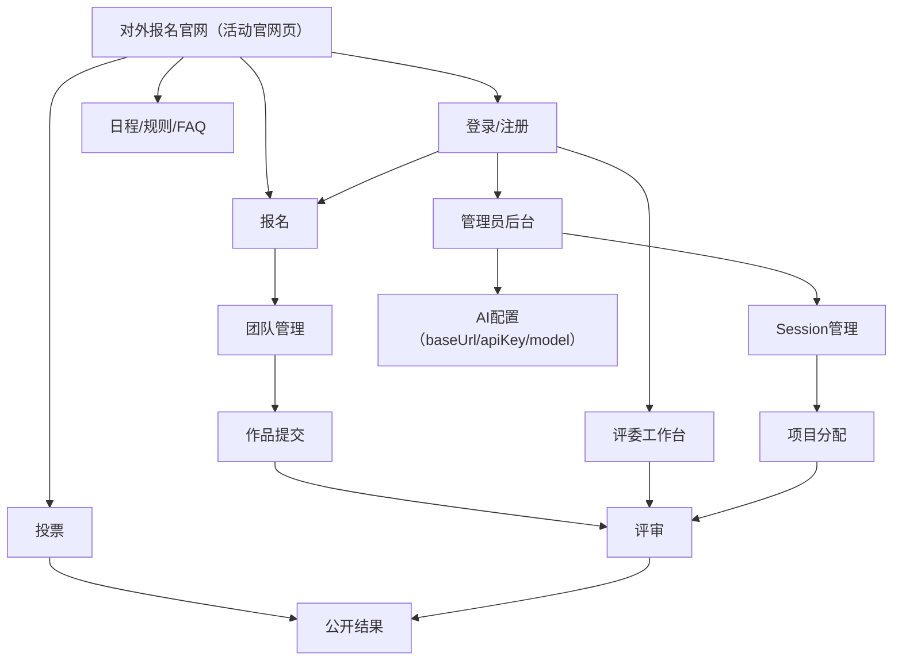

## 1. 产品概述
开源黑客松平台是一个现代化的在线竞赛管理平台，采用Apple风格设计，支持多阶段比赛（初赛、复赛、决赛）。平台提供完整的竞赛生命周期管理，包括评委注册、项目分配、在线评审等功能，确保评审过程的保密性和公正性。

平台采用响应式设计，支持网络评审，让评委可以随时随地进行作品评估。超级管理员可以创建不同的比赛session，灵活分配项目和评委，满足各种规模的竞赛需求。

**商业化定位**：面向高校、企业、政府机构的SaaS化黑客松管理平台，支持中英双语，提供多租户隔离和灵活的付费模式。

## 2. 核心功能

### 2.1 用户角色与SaaS权限模型

| 角色 | 登录/注册方式 | 核心权限 | SaaS层级 |
|------|---------------|----------|----------|
| 超级管理员 | 预置账号 | 全平台管理；租户管理；系统配置；AI服务配置 | 平台级 |
| 租户管理员 | 邮箱注册 + 付费开通 | 管理本租户下的活动、用户、数据；配置AI服务 | 租户级 |
| 活动主办方 | 租户管理员邀请/创建 | 管理指定活动；评委管理；结果发布 | 活动级 |
| 评委 | 自主注册 + 主办方审核 | 查看被分配作品；提交评分与评语；查看评审进度 | 活动级 |
| 选手 | 邮箱/GitHub/社交登录 | 报名参赛；团队管理；作品提交；查看结果 | 活动级 |
| 大众投票 | 邮箱验证码/第三方登录 | 浏览公开作品；参与投票；查看结果 | 公开级 |

### 2.2 SaaS功能模块与多租户架构

平台采用多租户架构，每个租户拥有独立的数据空间和管理权限：

**核心功能模块**：
1. **租户管理**：租户注册、配置、付费管理、资源配额控制
2. **国际化支持**：中英双语界面，动态语言切换，本地化内容管理
3. **对外报名官网（活动官网页）**：Banner、赛事说明、报名入口、日程、规则、FAQ（支持多语言）
4. **首页**：现代化展示、活动列表、关键入口（报名/投票/登录）
5. **登录/注册页**：多角色统一登录入口，支持社交登录
6. **报名页面**：选手报名、团队创建/加入，支持国际化表单
7. **作品提交页**：项目信息、演示材料、代码仓库，多语言支持
8. **投票页面**：大众投票登录、公开投票、防刷票机制
9. **在线评审系统**：评委评审、多维度打分、评语撰写，支持多语言评语
10. **比赛Session管理**：创建初赛、复赛、决赛等不同阶段
11. **项目分配管理**：管理员分配项目给指定评委
12. **活动管理**：活动创建、规则设置、时间安排，多语言内容管理
13. **获奖公布页**：结果展示、证书下载（如需），多语言证书
14. **管理后台**：用户/权限、数据安全、AI配置（baseUrl/apiKey/model）
15. **计费中心**：套餐管理、用量统计、付费记录、发票管理
16. **数据导出**：支持多语言数据导出，国际化报表生成

### 2.3 页面详情

| 页面名称 | 模块名称 | 功能描述 |
|----------|----------|----------|
| 对外报名官网（活动官网页） | Banner | 展示活动主题、时间地点（或线上）、主 CTA（立即报名/立即投票） |
| 对外报名官网（活动官网页） | 赛事说明 | 说明面向人群、参赛形式、提交物、评审维度（摘要） |
| 对外报名官网（活动官网页） | 报名 | 引导选手登录并报名；展示报名截止时间与名额（如有） |
| 对外报名官网（活动官网页） | 日程 | 展示关键节点：报名开始/截止、提交截止、评审期、公布结果 |
| 对外报名官网（活动官网页） | 规则 | 展示参赛规则、作品要求、评审规则、投票规则（摘要+详情链接/展开） |
| 对外报名官网（活动官网页） | FAQ | 展示高频问题：报名/组队/提交/投票/评审/隐私与版权 |
| 首页 | 现代化展示 | 采用Apple风格设计，玻璃拟态效果、流畅动画 |
| 首页 | 关键入口 | 提供报名/投票/登录入口，并突出当前活动状态 |
| 首页 | 活动轮播 | 3D轮播效果，展示不同阶段的比赛session |
| Session管理 | 比赛阶段创建 | 创建初赛、复赛、决赛，设置时间节点 |
| Session管理 | 项目分配 | 超级管理员分配项目给指定评委 |
| Session管理 | 评委管理 | 查看评委工作量，重新分配项目 |
| 评委注册 | 资质填写 | 专业背景、评审经验、擅长领域 |
| 评委注册 | 审核流程 | 主办方审核评委资质，分配合适项目 |
| 在线评审 | 网络评审界面 | 响应式设计，支持移动端评审 |
| 在线评审 | 多维度评分 | 创新性、技术性、完成度、展示效果 |
| 在线评审 | 评语撰写 | 富文本编辑器，支持语音输入 |
| 在线评审 | 进度跟踪 | 显示评审进度，已完成/待评审数量 |
| 活动管理 | 活动创建 | 设置活动信息、规则、奖项 |
| 活动管理 | 评委邀请 | 发送邀请链接，管理评委列表 |
| 报名页面 | 参赛者注册 | 简洁的注册流程，支持社交登录 |
| 报名页面 | 团队组建 | 智能匹配队友，团队管理功能 |
| 作品提交 | 项目信息 | 结构化表单，自动保存草稿 |
| 作品提交 | 演示材料 | 支持视频、PPT、代码仓库链接 |
| 投票页面 | 防刷票机制 | IP限制、验证码、投票间隔控制 |
| 投票页面 | 社交分享 | 一键分享到社交媒体平台 |
| 获奖公布 | 结果展示 | 动态榜单，实时更新排名 |
| 获奖公布 | 证书生成 | 自动生成电子证书，支持下载 |
| 管理后台 | 权限管理 | 基于角色的访问控制（RBAC） |
| 管理后台 | 数据隔离 | 评委只能看到分配的项目 |
| 管理后台 | 安全审计 | 记录所有操作日志，确保可追溯 |
| AI辅助功能 | AI评委配置 | 可选AI评委角色，支持技术/设计/产品专家 |
| AI辅助功能 | 智能匹配 | 基于技能的队友推荐系统 |
| AI辅助功能 | 内容生成 | 自动生成活动材料、评审标准 |
| AI辅助功能 | 抄袭检测 | AI检测项目原创性和相似度 |
| AI辅助功能 | 内容审核 | 自动审核提交内容和评论 |
| AI辅助功能 | 智能分析 | 提供项目质量分析和改进建议 |

## 3. 核心流程

### 管理员流程
1. 登录管理员账号进入管理后台
2. 配置活动官网内容（Banner/赛事说明/日程/规则/FAQ）
3. 管理评委与选手账号（审核/禁用/角色调整）
4. 创建比赛Session（初赛/复赛/决赛），设置时间节点
5. 分配作品给评委，监控评审进度并处理异常
6. 配置大众投票参数（投票期、限额、验证码/反刷）
7. 配置 AI 服务（OpenAI 兼容：baseUrl/apiKey/model），并启用/停用相关能力
8. 公布结果（含榜单与对外展示内容）

### 评委流程
1. 注册评委信息并等待管理员审核
2. 审核通过后登录评委工作台
3. 查看被分配作品并按评分标准打分与写评语
4. 跟踪个人评审进度直至完成

### 选手流程
1. 打开对外报名官网，查看赛事说明/日程/规则/FAQ
2. 注册并登录后报名参赛，创建或加入团队
3. 在规定时间内提交作品材料（链接/文件/说明）
4. 查看自己的作品状态与结果（公布后）

### 大众投票流程
1. 打开对外报名官网或投票页，使用邮箱验证码登录
2. 浏览公开作品列表与作品详情
3. 在投票期内为作品投票（限额/验证码/反刷）
4. 查看公开结果（投票结束或公布后）

## 4. 用户界面设计

### 4.1 设计风格与国际化
- **设计理念**：Apple风格现代化设计，极简主义与功能性的完美结合，支持全球化视觉语言
- **主色调**：纯白色 (#FFFFFF) 背景，营造简洁清爽的视觉体验
- **强调色**：深空灰 (#1d1d1f) 用于重要文字和按钮
- **辅助色**：苹果蓝 (#0071e3) 用于主要操作按钮和链接
- **玻璃拟态**：使用backdrop-filter实现现代化的毛玻璃效果
- **圆角设计**：12-16px圆角，体现友好和现代感
- **字体系统**：SF Pro Display 用于标题，SF Pro Text 用于正文，支持中文苹方和英文San Francisco
- **字体大小**：标题 28-34px，正文 16-18px，确保优秀的可读性
- **阴影效果**：柔和的投影效果，营造层次感但不突兀
- **动画效果**：流畅的过渡动画，提升用户体验
- **图标风格**：采用SF Symbols风格，线条简洁，语义明确
- **国际化图标**：支持RTL（右到左）语言布局适配
- **文化适配**：颜色、图标、布局考虑不同文化背景的用户习惯

### 4.2 页面设计概览

| 页面名称 | 模块名称 | UI元素 |
|----------|----------|--------|
| 首页 | 导航栏 | 玻璃拟态效果，浮动在内容上方，模糊背景穿透 |
| 首页 | 英雄区域 | 大尺寸视频背景，渐变色叠加，优雅的标题动画 |
| 首页 | 评委注册 | 醒目的玻璃拟态按钮，悬浮效果，引导评委注册 |
| Session管理 | 阶段卡片 | 玻璃拟态卡片，显示进度环，优雅的过渡动画 |
| Session管理 | 分配界面 | 拖拽式分配交互，实时保存，视觉反馈明确 |
| 评委注册 | 表单设计 | 大间距输入框，浮动标签，实时验证反馈 |
| 在线评审 | 评审界面 | 分屏布局，左侧项目详情，右侧评分面板 |
| 在线评审 | 评分组件 | 滑块式评分器，星星动画，实时平均分显示 |
| 在线评审 | 评语编辑器 | 富文本编辑器，工具栏悬浮，支持Markdown |
| 活动管理 | 数据表格 | 圆角表格设计，悬停高亮，排序动画流畅 |
| 作品展示 | 项目卡片 | 玻璃拟态效果，3D倾斜悬停，优雅阴影 |
| 投票页面 | 投票按钮 | 大圆角按钮，点击动画，防重复点击设计 |
| 获奖公布 | 榜单展示 | 动态排名效果，平滑过渡，庆祝动画 |
| 管理后台 | 统计面板 | 数据可视化图表，圆角设计，色彩和谐 |
| 全局组件 | 加载动画 | 优雅的骨架屏，渐进式加载，减少等待焦虑 |
| 全局组件 | 通知系统 | 顶部横幅通知，自动消失，不干扰用户操作 |

### 4.3 响应式设计
- **桌面优先**：默认设计为桌面端，充分利用大屏幕空间，支持多窗口操作
- **平板适配**：768px 以上保持完整功能布局，以下转为触控优化布局
- **移动端优化**：底部导航栏，触摸友好的大按钮（最小44px），简化信息展示
- **网络评审优化**：移动端评审界面，支持横竖屏切换，手势操作评分
- **触摸交互**：长按、滑动、捏合等手势操作，符合Apple设计规范
- **性能优化**：图片懒加载、分页加载、骨架屏，确保流畅体验
- **离线支持**：关键页面支持离线访问，评审数据本地缓存
- **设备适配**：支持iPhone、iPad、Mac等不同设备的原生体验

### 4.4 安全与保密性
- **数据加密**：所有敏感数据采用AES-256加密存储
- **访问控制**：基于角色的权限管理（RBAC），确保数据隔离
- **评审保密**：评委只能查看分配的项目，无法看到其他评委评分
- **通信安全**：所有数据传输采用HTTPS加密，支持TLS 1.3
- **身份验证**：多因素认证（MFA）支持，确保账号安全
- **审计日志**：完整的操作记录，支持行为分析和异常检测
- **数据备份**：加密备份机制，支持异地容灾恢复
- **隐私保护**：符合GDPR和国内数据保护法规要求

### 4.5 AI功能设计
- **AI评委系统**：可选AI评委角色，支持技术、设计、产品专家等不同人格
- **智能评分**：基于预设标准自动分析项目代码、文档和演示材料
- **队友匹配**：基于技能标签和项目需求智能推荐团队成员
- **内容生成**：自动生成活动描述、评审标准、获奖证书等
- **抄袭检测**：AI检测项目代码和创意的原创性，防止抄袭
- **内容审核**：自动审核用户提交的内容，过滤不当信息
- **智能建议**：为参赛者提供项目改进建议和技术指导
- **数据分析**：智能分析评审数据，发现潜在问题和趋势

### 4.6 SaaS商业化模式

#### 4.6.1 付费模式
**基础版（免费）**：
- 最多3个活动
- 最多100个参赛者
- 基础评审功能
- 社区支持

**专业版（月付/年付）**：
- 无限活动数量
- 最多1000个参赛者
- 高级评审功能
- AI辅助评审
- 数据分析报告
- 邮件支持

**企业版（定制）**：
- 无限活动数量
- 无限参赛者
- 所有高级功能
- 白标定制
- 专属客户经理
- 24/7电话支持

#### 4.6.2 计费维度
- 活动数量：按创建的活动数量计费
- 参赛人数：按实际参赛人数计费
- 存储空间：按文件存储使用量计费
- AI调用次数：按AI服务调用次数计费
- 高级功能：按使用的增值功能计费

#### 4.6.3 多租户数据隔离
**数据层隔离**：
- 每个租户拥有独立的数据库schema
- 行级安全策略(RLS)确保数据隔离
- 加密存储确保数据安全

**应用层隔离**：
- 租户ID贯穿所有API调用
- 中间件验证租户权限
- 缓存隔离防止数据泄露

**资源隔离**：
- 独立的计算资源配额
- 独立的存储空间限制
- 独立的AI调用配额

### 4.7 i18n国际化支持

#### 4.7.1 语言支持
**核心语言**：
- 简体中文（zh-CN）
- 英语（en-US）

**扩展语言**（企业版）：
- 繁体中文（zh-TW）
- 日语（ja-JP）
- 韩语（ko-KR）

#### 4.7.2 国际化功能
**界面国际化**：
- 动态语言切换
- 本地化日期时间格式
- 本地化数字格式
- RTL布局支持

**内容国际化**：
- 活动内容多语言支持
- 评审标准多语言
- 邮件模板多语言
- 错误信息本地化

**API国际化**：
- 支持Accept-Language头
- 错误信息本地化
- 数据格式本地化

### 4.8 现代视觉风格变更记录

#### 4.8.1 设计系统升级（2024年）
**色彩系统**：
- 采用Apple Human Interface Guidelines色彩体系
- 增加玻璃拟态(Glassmorphism)效果
- 引入动态色彩适应(Dynamic Color)

**排版系统**：
- 统一使用SF Pro字体家族
- 建立完整的字体层级系统
- 优化中英文混排显示

**组件库升级**：
- 统一的圆角系统(8px, 12px, 16px)
- 一致的阴影系统
- 标准化的间距系统(4px网格)

#### 4.8.2 交互体验优化
**动画系统**：
- 引入Framer Motion动画库
- 统一的过渡时间和缓动函数
- 微交互动画增强用户体验

**响应式设计**：
- 移动优先的设计理念
- 断点系统优化(320px, 768px, 1024px, 1440px)
- 触摸目标尺寸优化(最小44px)

#### 4.8.3 可访问性提升
**WCAG 2.1 AA标准**：
- 色彩对比度达到4.5:1以上
- 键盘导航完全支持
- 屏幕阅读器优化

**包容性设计**：
- 色盲友好的色彩方案
- 可调节的字体大小
- 高对比度模式支持
- **容器化部署**：Docker + Kubernetes，支持弹性扩缩容
- **环境隔离**：开发、测试、生产环境完全隔离
- **监控告警**：实时监控性能指标，异常自动告警
- **灰度发布**：支持滚动更新，确保服务连续性
- **域名配置**：支持自定义域名，自动HTTPS证书管理
- **性能优化**：CDN加速、数据库连接池、Redis缓存
- **安全加固**：定期安全扫描，漏洞自动修复
- **灾备方案**：多地域部署，自动故障转移
- **AI服务部署**：独立的AI服务容器，支持弹性扩容