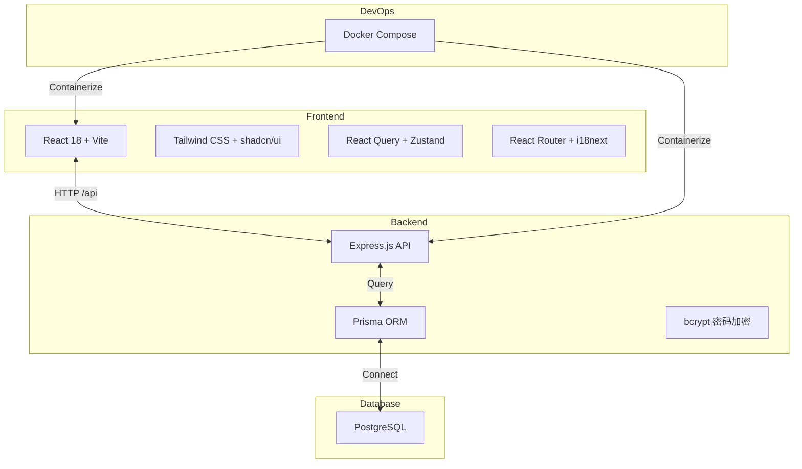

<div align="center">

# OpenHackathon
> 白标黑客松管理平台 · White-label Hackathon Platform


### 🚀 部署即拥有你自己的黑客松官网


[核心功能](#-核心功能) • [界面预览](#-界面预览) • [快速开始](#-快速开始) • [技术架构](#-技术架构) • [部署指南](#-部署指南)

__简体中文__ | [English](./README_EN.md)

---
</div>

## 📖 项目简介

OpenHackathon 是一个现代化的**白标黑客松管理平台**，专为高校、企业和开发者社区设计。管理员可在后台轻松管理多个比赛活动，评委可在线评审项目，选手可提交作品并查看排名。

### 为什么选择 OpenHackathon？

| 传统方式 | OpenHackathon |
|---------|--------------|
| 从零开发，耗时数月 | 一键部署，即刻使用 |
| 功能单一，难以扩展 | 多角色权限，灵活配置 |
| 评审流程混乱 | 系统化分配与评分 |
| 无数据洞察 | 实时统计与排行榜 |

## ✨ 核心功能

### 1. 🎨 白标定制
通过环境变量自定义品牌标识，打造专属竞赛平台：

- **品牌配置** — 自定义主办方名称、Logo、主色调
- **无平台烙印** — 可选择隐藏 Powered by 标识
- **灵活适配** — 快速部署为高校、企业、政府机构的专属平台


### 2. 👥 多角色权限体系

| 角色 | 权限范围 | 使用场景 |
|------|---------|---------|
| **管理员** | 创建/管理比赛、分配评委、查看全部数据 | 主办方运营团队 |
| **评委** | 查看分配项目、多维度评分、AI 辅助评审 | 技术专家、投资人 |


### 3. ⚖️ 智能评审系统

- **项目分配** — 灵活分配项目给指定评委，确保评审独立性
- **多维度评分** — 支持自定义评分标准（创新、技术、设计、完成度等）
- **AI 辅助评审** — 智能生成评审建议，提升评审效率
- **实时计算** — 自动计算总分与排名


### 4. 🏆 排行榜与展示

- **公开排行榜** — 实时更新的项目排名展示
- **项目画廊** — 美观的项目展示页面，支持标签筛选
- **数据分析** — 评审进度、分数分布等统计图表


### 5. 📁 项目管理

- **项目提交** — 支持自定义提交表单字段
- **作品展示** — 项目详情页展示描述、截图、链接
- **批量管理** — 导入导出、批量分配评委


### 6. 🌍 开发者体验

- **国际化** — 中英双语支持，基于 react-i18next
- **暗黑模式** — 内置主题切换，护眼舒适
- **响应式设计** — 支持桌面端、平板、手机访问
- **TypeScript 全栈** — 类型安全，开发体验佳

## 🖼️ 界面预览

| 首页 | 项目画廊 | 排行榜 |
|------|---------|--------|
|  |  |  |
| 英雄区、倒计时、报名入口 | 项目卡片、标签筛选、搜索 | 实时排名、得分展示、颁奖台 |

| 管理后台 | 评审界面 | 活动设置 |
|----------|---------|---------|
|  |  |  |
| 数据统计、活动切换、快捷操作 | 项目详情、滑动评分、AI 建议 | 比赛配置、评分标准、规则设置 |

## 🚀 快速开始

### 环境要求

- Node.js 18+
- PostgreSQL 15+
- Docker & Docker Compose（可选，用于生产部署）

### 本地开发

```bash
# 1. 克隆仓库
git clone https://github.com/frankfika/openhackathon.git
cd openhackathon

# 2. 安装依赖
npm install

# 3. 配置环境变量
cp .env.example .env
# 编辑 .env 设置数据库连接和白标配置

# 4. 初始化数据库
npx prisma migrate dev --name init
npx prisma db seed

# 5. 启动开发服务器
npm run dev
```

访问 http://localhost:5173

**默认账号：**
- 管理员：`admin@openhackathon.com` / `password`
- 评委：`alice@techgiants.com` / `password`

## 🏗️ 技术架构



### 目录结构

```
openhackathon/
├── api/
│   └── server.ts              # Express 后端服务
├── prisma/
│   ├── schema.prisma          # 数据库模型定义
│   └── seed.ts                # 种子数据
├── src/
│   ├── components/            # React 组件
│   │   ├── ui/                # shadcn/ui 组件
│   │   └── dashboard/         # 仪表盘组件
│   ├── lib/
│   │   ├── api.ts             # API 客户端
│   │   ├── auth.tsx           # 认证上下文
│   │   ├── types.ts           # TypeScript 类型
│   │   └── i18n.ts            # 国际化配置
│   ├── pages/                 # 页面组件
│   └── App.tsx                # 应用入口
├── docs/assets/               # 截图资源
└── scripts/                   # 工具脚本
```

## 📦 部署指南

### 方式一：Docker Compose（推荐）

```bash
# 克隆仓库
git clone https://github.com/frankfika/openhackathon.git
cd openhackathon

# 启动所有服务
docker-compose up -d --build

# 初始化数据库
docker-compose exec api npx prisma migrate dev --name init
docker-compose exec api npx prisma db seed
```

服务端口：

| 服务 | 端口 | 说明 |
|------|------|------|
| Web | 5173 | React 前端 |
| API | 3001 | Express 后端 |
| DB | 5432 | PostgreSQL |
| Adminer | 8080 | 数据库管理界面 |

### 方式二：手动部署

```bash
# 构建前端
npm run build

# 启动后端
npm run server

# 使用 Nginx 或 Caddy 反向代理
```

### 白标配置

通过环境变量自定义品牌：

| 变量 | 默认值 | 说明 |
|------|--------|------|
| `VITE_ORGANIZER_NAME` | `Acme Corp` | 主办方名称 |
| `VITE_ORGANIZER_LOGO` | - | Logo URL |
| `VITE_PRIMARY_COLOR` | `#6366f1` | 主色调 |
| `VITE_SHOW_POWERED_BY` | `true` | 显示 Powered by |

## 🛣️ 路线图

### v1.0.0 (当前)
- ✅ 白标配置系统
- ✅ 多角色权限管理
- ✅ 比赛 Session 管理
- ✅ 项目分配与评审
- ✅ 实时排行榜
- ✅ 中英双语支持
- ✅ Docker 部署

### v1.1.0 (计划中)
- 🚧 团队管理功能
- 🚧 在线代码提交集成
- 🚧 更多 AI 辅助功能
- 🚧 邮件通知系统

### v1.2.0 (计划中)
- 🚧 支付集成（报名费）
- 🚧 证书自动生成
- 🚧 更多主题模板
- 🚧 移动端 App

## 🤝 贡献指南

1. Fork 本仓库
2. 创建功能分支 `git checkout -b feature/amazing-feature`
3. 提交更改 `git commit -m 'feat: add amazing feature'`
4. 推送分支 `git push origin feature/amazing-feature`
5. 创建 Pull Request

### 开发规范

- 使用 TypeScript 严格模式
- 组件使用函数式编程
- 提交信息遵循 [Conventional Commits](https://conventionalcommits.org/)
- 代码通过 ESLint 检查

## 📄 许可证

Copyright © 2025 OpenHackathon Team

Licensed under the [MIT License](./LICENSE)

---

<p align="center">
  Made with ❤️ for the hackathon community
</p>
