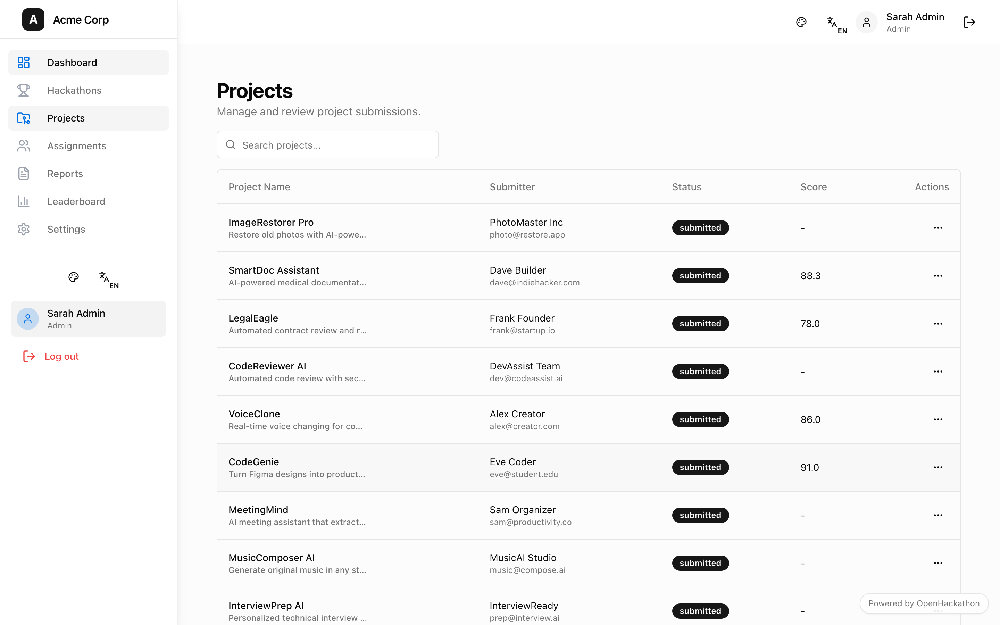
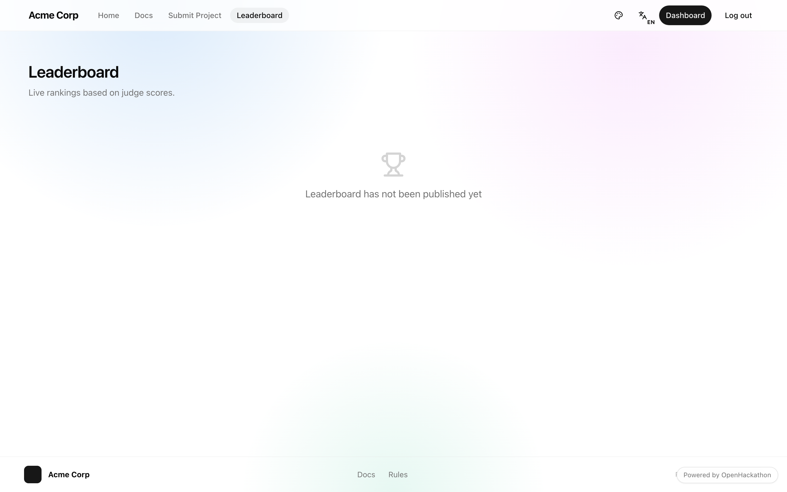
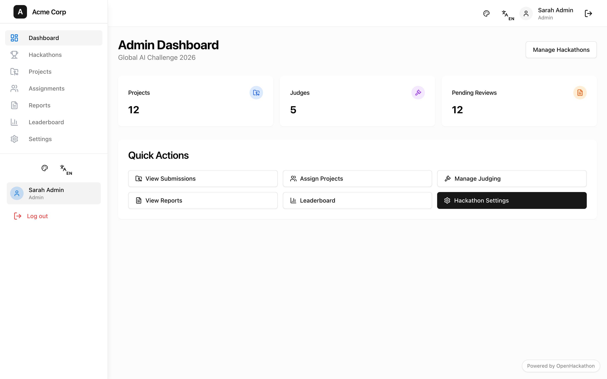
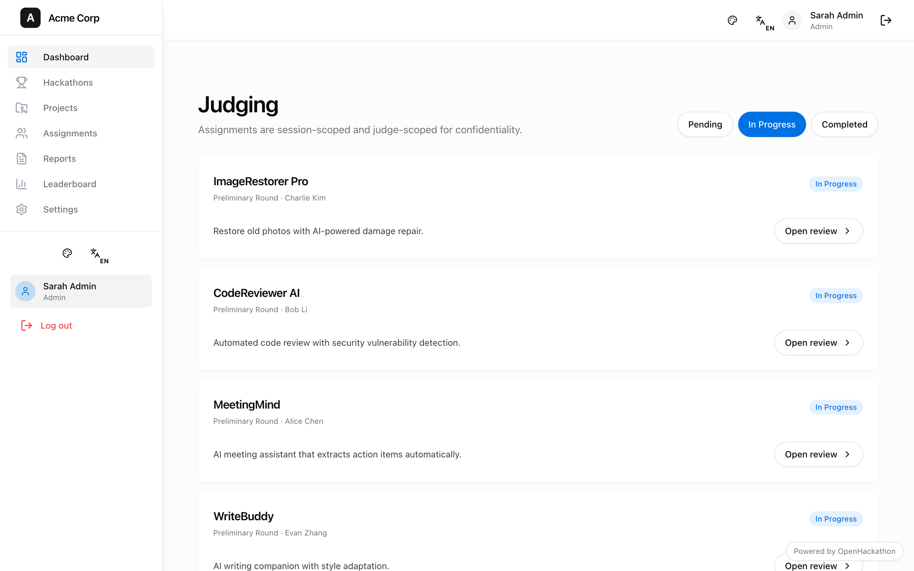
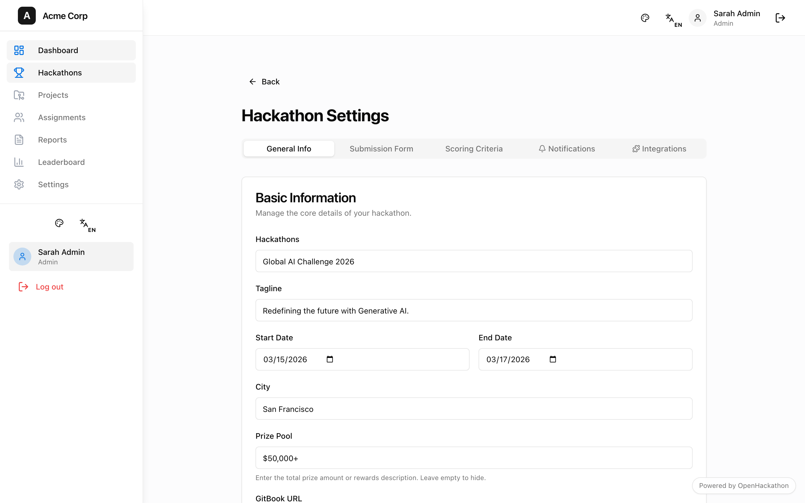
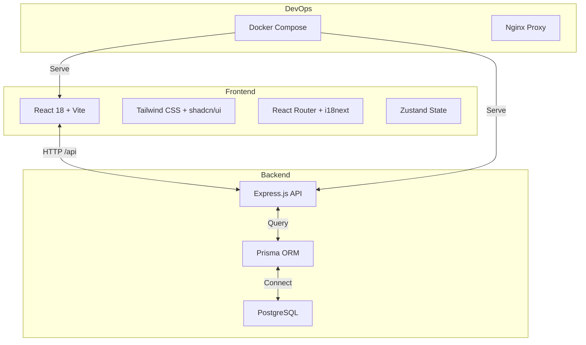

<div align="center">

# OpenHackathon
> 白标黑客松管理平台 · White-label Hackathon Platform

<!-- 首页截图 - 请替换为实际截图 -->
<!--  -->

### 部署即拥有你自己的黑客松官网


[核心功能](#-核心功能) • [界面导览](#-界面导览) • [技术架构](#-技术架构) • [快速开始](#-快速开始) • [部署指南](#-部署指南)

__简体中文__ | [English](./README_EN.md)

---
</div>

OpenHackathon 是一个现代化的白标黑客松管理平台。管理员可在后台管理多个比赛活动，选择当前展示的活动；访客在公开页面始终只看到当前活跃的比赛信息。

## 核心功能

### 1. 白标定制
- **品牌配置** — 通过环境变量自定义主办方名称、Logo、主色调
- **无平台烙印** — 公开页面不显示 "OpenHackathon" 品牌（可隐藏 Powered by 标识）
- **灵活适配** — 快速部署为高校、企业、政府机构的专属竞赛平台

### 2. 多角色权限体系
| 角色 | 权限范围 |
|------|----------|
| **管理员** | 创建/管理多个比赛、分配项目给评委、查看全部数据 |
| **评委** | 查看分配的项目、多维度评分、AI 辅助评审 |
| **选手** | 报名参赛、团队管理、项目提交、查看结果 |

### 3. 比赛生命周期管理
- **Session 管理** — 支持初赛、复赛、决赛等多阶段比赛
- **项目分配** — 灵活分配项目给指定评委，确保评审独立性
- **在线评审** — 响应式评审界面，支持移动端评分
- **排行榜** — 公开和后台双端排行榜，实时更新排名

### 4. 开发者体验
- **国际化** — 中英双语支持，基于 react-i18next
- **暗黑模式** — 内置主题切换
- **HTTPS 开发** — 自动检测本地 mkcert 证书
- **TypeScript 全栈** — 前端 React + 后端 Express 统一类型系统

## 界面导览

<!-- 以下为截图占位区，请使用以下命令截取实际界面：
  npx playwright install chromium
  node scripts/capture-screenshots.mjs
-->

| 首页 | 项目展示 | 排行榜 |
|------|----------|--------|
|  |  |  |
| 英雄区、倒计时、报名入口 | 项目画廊、作品详情 | 实时排名、得分展示 |

| 管理后台 | 评审界面 | 活动设置 |
|----------|----------|----------|
|  |  |  |
| 数据统计、活动切换 | 项目评分、AI 辅助 | 比赛配置、规则设置 |

## 技术架构



### 目录结构

```
src/
├── lib/
│   ├── site-config.ts          # 白标配置（读取 VITE_* 环境变量）
│   ├── active-hackathon.tsx    # 当前活动上下文
│   ├── auth.tsx                # 角色认证
│   └── api.ts                  # Axios 客户端
├── pages/
│   ├── Landing.tsx             # 公开首页
│   ├── Docs.tsx                # 文档嵌入（GitBook）
│   ├── Projects.tsx            # 项目画廊
│   ├── Leaderboard.tsx         # 排行榜
│   ├── SubmitProject.tsx       # 项目提交
│   └── Dashboard.tsx           # 角色仪表盘
├── components/
│   ├── Layout.tsx              # 公开页布局
│   ├── DashboardLayout.tsx     # 后台布局
│   └── HackathonSwitcher.tsx   # 活动切换器
api/
└── server.ts                   # Express 服务
prisma/
└── schema.prisma               # 数据库模型
```

## 快速开始

### 环境要求
- Node.js 18+
- pnpm (推荐) 或 npm
- Docker & Docker Compose (生产部署)

### 本地开发

```bash
# 1. 克隆仓库
git clone https://github.com/frankfika/openhackathon.git
cd openhackathon

# 2. 安装依赖
pnpm install

# 3. 配置环境变量
cp .env.example .env
# 编辑 .env 设置白标配置

# 4. 启动开发服务器（前端 + 后端）
pnpm dev
```

访问 http://localhost:5173，前端端口 5173，API 端口 3001。

### HTTPS 本地开发（可选）

```bash
# 安装 mkcert
brew install mkcert
mkcert -install

# 生成证书
mkcert localhost

# 重启 dev 服务器自动启用 HTTPS
```

## 部署指南

### 方式一：Docker Compose（推荐）

```bash
git clone https://github.com/frankfika/openhackathon.git
cd openhackathon
docker-compose up -d --build
```

服务端口：

| 服务 | 端口 | 说明 |
|------|------|------|
| Web | 5173 | React 前端 |
| API | 3001 | Express 后端 |
| DB | 5432 | PostgreSQL |
| Adminer | 8080 | 数据库管理界面 |

数据库初始化：

```bash
docker-compose exec api sh
npx prisma migrate dev --name init
```

### 方式二：Vercel 部署

[](https://vercel.com/new/clone?repository-url=https://github.com/frankfika/openhackathon)

### 白标配置

通过环境变量自定义品牌：

| 变量 | 默认值 | 说明 |
|------|--------|------|
| `VITE_ORGANIZER_NAME` | `Acme Corp` | 主办方名称 |
| `VITE_ORGANIZER_LOGO` | - | Logo URL（设置后替换文字） |
| `VITE_PRIMARY_COLOR` | `#4F46E5` | 主色调 |
| `VITE_SHOW_POWERED_BY` | `true` | 是否显示 Powered by 标识 |

## 演示账号

使用以下账号体验不同角色：

| 角色 | 账号 | 体验内容 |
|------|------|----------|
| 管理员 | Sarah Admin | 活动管理、项目分配、所有配置 |
| 评委 | Alice Chen | 评审队列、AI 辅助、评分界面 |
| 选手 | Dave Builder | 报名、团队、项目提交 |

## 技术栈

- **Frontend**: React 18, TypeScript, Vite, Tailwind CSS, shadcn/ui
- **State**: Zustand, TanStack Query
- **Form**: React Hook Form + Zod
- **Animation**: Framer Motion
- **Backend**: Express, Prisma, PostgreSQL
- **i18n**: react-i18next
- **DevOps**: Docker Compose

## 版本演进

### v0.1.0 (Current)
- 白标配置系统
- 多角色权限管理
- 比赛 Session 管理
- 项目分配与评审
- 中英双语支持
- Docker 部署支持

## 开发者与社区

### 贡献指南

1. Fork 本仓库
2. 创建功能分支 `git checkout -b feature/amazing-feature`
3. 提交更改 `git commit -m 'Add amazing feature'`
4. 推送分支 `git push origin feature/amazing-feature`
5. 创建 Pull Request

### 开发规范

- 使用 TypeScript 严格模式
- 组件使用函数式编程
- 提交信息遵循 Conventional Commits
- 代码通过 ESLint 检查

## 鸣谢

- [shadcn/ui](https://ui.shadcn.com/) - 优雅的 UI 组件
- [Radix UI](https://www.radix-ui.com/) - 无障碍原语
- [Lucide](https://lucide.dev/) - 图标系统

---

Copyright © 2025 OpenHackathon Team

Licensed under the [MIT License](./LICENSE)
