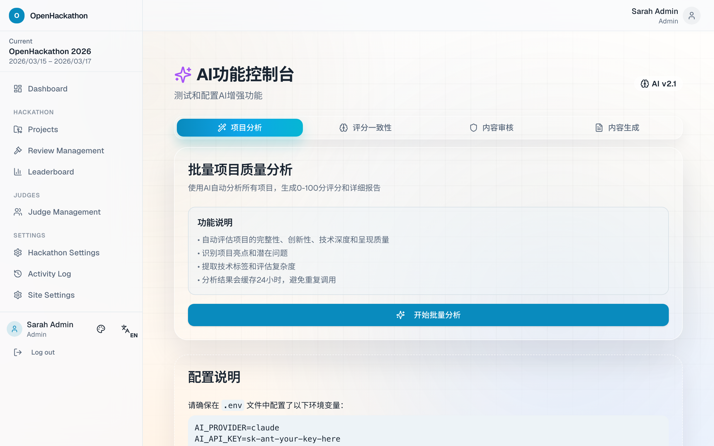

<div align="center">

# OpenHackathon
> 开源黑客松全流程管理平台 · Open Source Hackathon Management Platform


### 从赛事创建到排行榜发布，一站式管理黑客松


[核心功能](#-核心功能) • [界面导览](#-界面导览) • [架构](#-架构) • [快速开始](#-快速开始) • [部署](#-部署) • [开发者上手](./docs/setup-wizard.md)

__简体中文__ | [English](./README_EN.md)

---
</div>

## 📖 项目简介

OpenHackathon 是面向黑客松主办方、评委与参赛团队的**全流程管理平台**，覆盖从赛事创建、项目提交、评审分配、打分评审到排行榜发布的完整链路。

平台提供三套独立入口：
- **参赛者**（公开访问）：浏览赛事首页、提交项目、查看排行榜
- **管理员**（`/admin/login`）：管理赛事配置、项目、评委、评审分配、排行榜、站点设置
- **评委**（`/judge/login`）：查看分配的评审任务、打分、提交评语

全站支持 **中英文双语实时切换**、**深浅主题切换**、**字体大小与字体族调整**，并已接入 **Web3 钱包登录与跨赛事积分**。

---

## ✨ 核心功能

### 1. 公开赛事页面
参赛者无需登录即可浏览当前赛事：
- 赛事名称、标语、状态徽章（Draft / Upcoming / Active / Judging / Completed）
- 举办城市、日期范围、奖金池
- 倒计时组件与提交入口
- 响应式深浅主题适配


### 2. 项目提交与回执
- 表单字段完全由主办方在后台配置
- 内置字段：项目名称（必填）、邮箱（必填）、姓名（选填）
- 提交后自动生成回执号（如 `SUB-20260228-ABC123`）
- 支持 SMTP 自动发送确认邮件


### 3. 管理后台
登录后进入仪表盘，左侧侧边栏按功能域分组：
- **Hackathon**：Projects / Assignments / Leaderboard
- **Judges**：Judge Management
- **Settings**：Hackathon Settings / Activity Log / Site Settings / AI Features


### 4. 评审分配与评分
- 随机 / 手动分配评委到项目
- 实时统计：Total Projects、Average Score、Completion Rate、Judges
- 列表视图与矩阵视图
- 评分标准由管理员自定义，总分必须恰好为 100 分


### 5. AI 增强系统（v2.1）
智能化赋能每个角色：
- 🤖 **项目质量评估**：AI 自动分析项目，生成 0-100 分评分 + 详细报告
- 🎯 **评委智能助手**：评审时提供 AI 建议、项目摘要、关键技术点、评分参考
- 📊 **评分一致性分析**：实时监控评委评分偏差，识别过严/过宽评委
- 🛡️ **内容审核**：自动检测敏感内容、垃圾信息
- ✍️ **智能内容生成**：一键生成 README、优化项目描述、生成赛事宣传文案
- 🔍 **抄袭检测**：智能识别相似项目

支持 Claude (Anthropic)、OpenAI、DeepSeek、本地 Ollama 等多种 AI 提供商。



### 6. Web3 多链身份与积分
- 🔗 **钱包登录**：基于 RainbowKit + wagmi，支持 EVM 钱包通过 SIWE 登录
- 🏆 **跨赛事积分**：Web3 用户拥有全局积分、参赛次数、评审次数、获奖次数
- 🌐 **跨赛事排行榜**：`Global Leaderboard` 展示全平台用户排名
- 👤 **个人资料页**：展示钱包地址、积分历史、参与记录
- ⛓️ **可选链上证明**：管理员可将关键数据写入链上作为可验证证明（可选）


### 7. 外观与无障碍
- 🌙 浅色 / 深色 / 跟随系统三种主题模式
- 🔤 字体大小：Small / Normal / Large
- 🖋️ 字体族：Geist / System UI
- ♿ 语义化颜色、高对比度、键盘可访问


### 8. 品牌白标与站点设置
- 自定义站点名称、Logo、Favicon、浏览器标签标题
- SEO 标题与描述
- 页脚 Powered By 文案与链接
- 自定义管理后台入口路径（`adminBasePath`）

---

## 🖼️ 界面导览

| 公开首页 | 项目提交 | 公开排行榜 |
|---|---|---|
|  |  |  |

| 管理员登录 | 评委登录 | 管理仪表盘 |
|---|---|---|
|  |  |  |

| 项目管理 | 评审分配 | 评委管理 |
|---|---|---|
|  |  |  |

| 赛事设置 | 提交表单配置 | 评分标准 |
|---|---|---|
|  |  |  |

| 排行榜管理 | 操作日志 | 站点设置 |
|---|---|---|
|  |  |  |

| AI 功能中心 | 评委工作台 |
|---|---|
|  |  |

---

## 🏛️ 架构

### 技术栈
| 层 | 技术 |
|---|---|
| 前端 | React 18 + Vite + TailwindCSS + shadcn/ui + React Query + react-i18next |
| 后端 | Express.js + Prisma ORM + PostgreSQL |
| Web3 | wagmi + RainbowKit + viem + Solana Wallet Adapter |
| 测试 | Vitest（单元 + API）+ Playwright（E2E）|
| 部署 | GitHub Actions → PM2 + Nginx |

### 后端模块化架构
```
api/
├── server.ts          # Express 应用入口
├── config.ts          # 环境变量与常量
├── middleware.ts      # JWT 认证、角色鉴权、速率限制
├── routes/            # 路由模块
│   ├── auth.ts        # 登录/注册（admin + judge 独立）
│   ├── hackathons.ts  # 赛事 CRUD
│   ├── projects.ts    # 项目提交、编辑、删除
│   ├── assignments.ts # 评审分配
│   ├── scores.ts      # 评分提交
│   ├── judges.ts      # 评委管理
│   ├── ai.ts          # AI 功能 API
│   ├── web3-auth.ts   # Web3 钱包登录
│   ├── identity.ts    # 跨赛事身份与积分
│   ├── leaderboard.ts # 排行榜管理
│   ├── site-settings.ts # 站点设置
│   └── ...
└── services/          # 业务服务
    ├── ai.ts          # AI 服务
    ├── identity.ts    # Web3 身份服务
    ├── points.ts      # 积分服务
    └── onchain.ts     # 链上交互
```

### 安全机制
| 机制 | 说明 |
|---|---|
| JWT 认证 | admin / judge 独立令牌，支持 issuer/audience 校验 |
| 输入校验 | 全字段白名单校验 + 长度限制 + SQL 注入/XSS 关键词过滤 |
| 速率限制 | 全局 1200/15min + 登录 20/15min + 提交 30/10min |
| CORS | 支持逗号分隔域名白名单 |
| 文件上传 | 类型/大小白名单 + 文件名安全过滤 |

---

## 🚀 快速开始

### 环境要求
- Node.js 20+
- Docker + Docker Compose

### 一键启动
```bash
git clone https://github.com/frankfika/openhackathon.git
cd openhackathon
npm install
npm run dev:up
```

自动完成：启动 PostgreSQL → 等待数据库就绪 → 同步 Prisma schema → 启动前后端开发服务。

首次访问会进入 **Setup Wizard**（`/setup`），引导创建管理员账号和初始赛事。

### 常用命令
```bash
npm run dev:up         # 启动开发栈（不含 seed 数据）
npm run dev:up:seed    # 启动开发栈 + 写入演示数据
npm run dev:down       # 关闭数据库容器
npm run db:reset:seed  # 重置 + 写入演示数据
npm run dev            # 仅启动前后端（需自行管理数据库）
```

### 默认账号（seed 数据）
| 角色 | 邮箱 | 密码 |
|---|---|---|
| 管理员 | `admin@openhackathon.com` | `password` |
| 评委 | `alice@techgiants.com` | `password` |
| 评委 | `bob@venturecap.com` | `password` |
| 评委 | `charlie@designstudio.io` | `password` |
| 空评委 | `judge1@openhackathon.com` | `password` |

> **注意**：上表只展示部分账号，完整列表与"为什么没有 `seed.ts`"的说明见 [docs/setup-wizard.md](./docs/setup-wizard.md)。新开发者请优先阅读该文档。

---

## 🧪 测试

```bash
npm run test:unit      # 单元测试（Vitest）
npm run test:api       # API 集成测试
npm run test:storybook # Storybook 组件测试
npm run test:e2e       # E2E 端到端测试（Playwright）
npm run lint           # ESLint 检查
npx tsc --noEmit       # TypeScript 类型检查
```

---

## 🏗️ 部署

### 在线演示
> **体验地址：http://49.234.25.35**

### 一键部署（Ubuntu）
```bash
curl -fsSL https://raw.githubusercontent.com/frankfika/openhackathon/main/scripts/deploy-server.sh | bash
```

### 自动部署（CI/CD）
推送到 `main` 分支后 GitHub Actions 自动部署：
```bash
git push origin main
```

### Docker Compose
```bash
docker compose up -d --build
```

默认端口：
| 服务 | 端口 |
|---|---|
| Web | `5173` |
| API | `3001` |
| PostgreSQL | `5432` |
| Adminer | `8080` |

---

## 📸 截图脚本

所有 README 截图均从真实运行的应用截取：
```bash
npm run dev
node scripts/capture-screenshots.mjs
```

---

## 📝 更新日志

### v2.1 (2026-06)
- ✨ AI 增强系统：项目质量评估、评委助手、评分一致性分析、内容审核、智能生成、抄袭检测
- 🔗 Web3 多链身份：钱包登录、跨赛事积分、全球排行榜、链上可选证明
- 🎨 外观设置：主题切换、字体大小/字体族调整
- 🐛 修复深色主题与悬浮导航重叠等视觉细节

### v2.0 (2026-03)
- 🏆 完整黑客松管理流程上线
- 🌐 中英双语、深浅主题
- 📊 评审分配、评分、排行榜管理
- 🛡️ JWT 认证、速率限制、操作日志

---

## 📦 发布
- Releases: https://github.com/frankfika/openhackathon/releases

## 📄 License
MIT
