<div align="center">

# OpenHackathon
> 开源黑客松管理平台 · Open Source Hackathon Management Platform

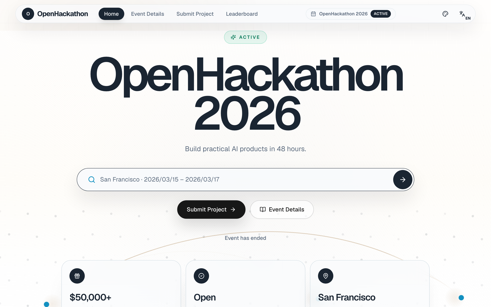


[公开页面](#-公开页面) • [管理后台](#-管理后台) • [评委工作台](#-评委工作台) • [架构](#-架构) • [快速开始](#-快速开始) • [部署](#-部署)

__简体中文__ | [English](./README_EN.md)

---
</div>

## 📖 项目简介

OpenHackathon 是一个面向黑客松主办方、评委与参赛团队的**全流程管理平台**，覆盖从赛事创建、项目提交、评审分配、打分评审到排行榜发布的完整链路。

三种角色、三套独立入口：
- **参赛者**（公开访问）：浏览赛事首页、提交项目、查看排行榜
- **管理员**（`/admin/login`）：管理赛事配置、项目、评委、评审分配、排行榜、站点设置
- **评委**（`/judge/login`）：查看分配的评审任务、打分、提交评语

全站支持 **中英文双语实时切换** 和 **深浅主题切换**。

---

## 🌐 公开页面

### 赛事首页

公开首页展示当前赛事的核心信息：赛事名称、标语、状态徽章（Draft / Upcoming / Active / Judging / Completed）、举办城市、日期范围、奖金池。页面背景为动态渐变动画，底部提供「提交项目」和「赛事详情」两个入口按钮。

顶部导航栏包含四个公开入口：首页、赛事详情、提交项目、排行榜。右上角显示当前赛事名称和状态，以及主题/语言切换按钮。


### 项目提交

提交页采用 **左右分栏** 设计：

- **左侧引导面板**：展示提交流程三步骤（填写联系信息 → 完成项目资料 → 获取提交回执），显示目标赛事名称和日期
- **右侧动态表单**：分为「联系信息」和「项目详情」两个区域，表单字段完全由主办方在后台配置

内置字段（不可移除）：项目名称（必填）、邮箱（必填）、姓名（选填）。主办方可额外添加自定义字段（text / textarea / URL / select），每个字段可设置标签、占位符、是否必填。

提交成功后自动生成回执号（如 `SUB-20260228-ABC123`），并可通过 SMTP 自动发送确认邮件。

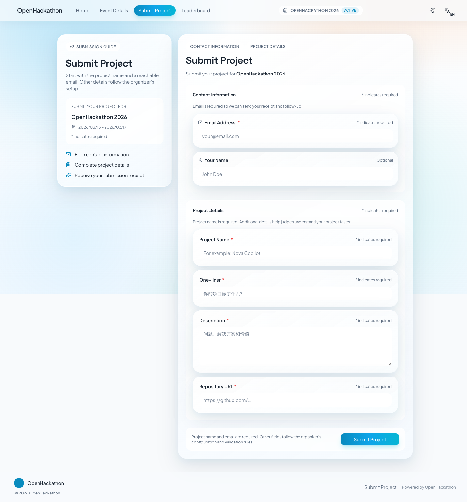

### 排行榜

公开排行榜展示管理员发布的最终排名。未发布前显示空状态提示。支持按自定义提交字段筛选。

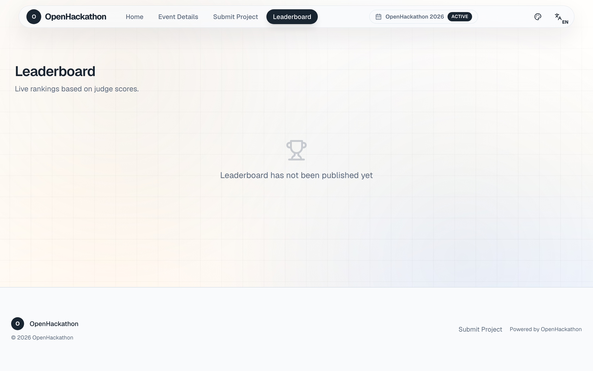

---

## 🔐 登录系统

系统提供两个独立的登录入口，管理员和评委使用完全隔离的令牌和会话存储，互不干扰：

| 管理员登录 (`/admin/login`) | 评委登录 (`/judge/login`) |
|---|---|
| 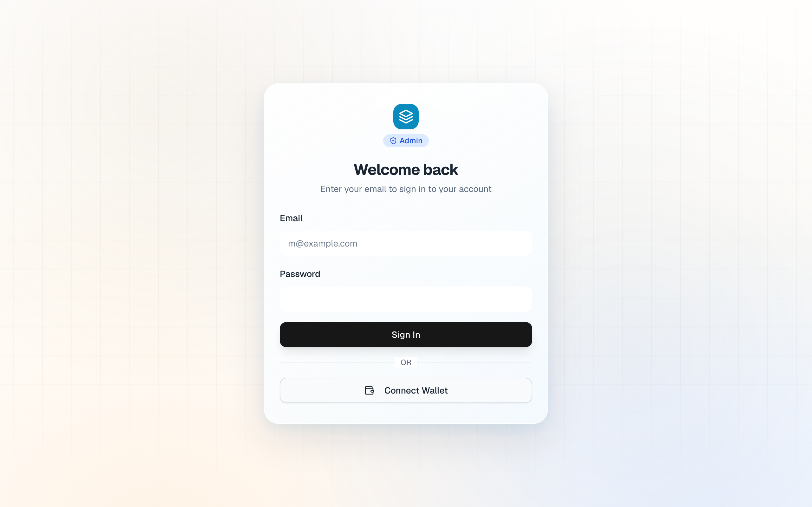 | 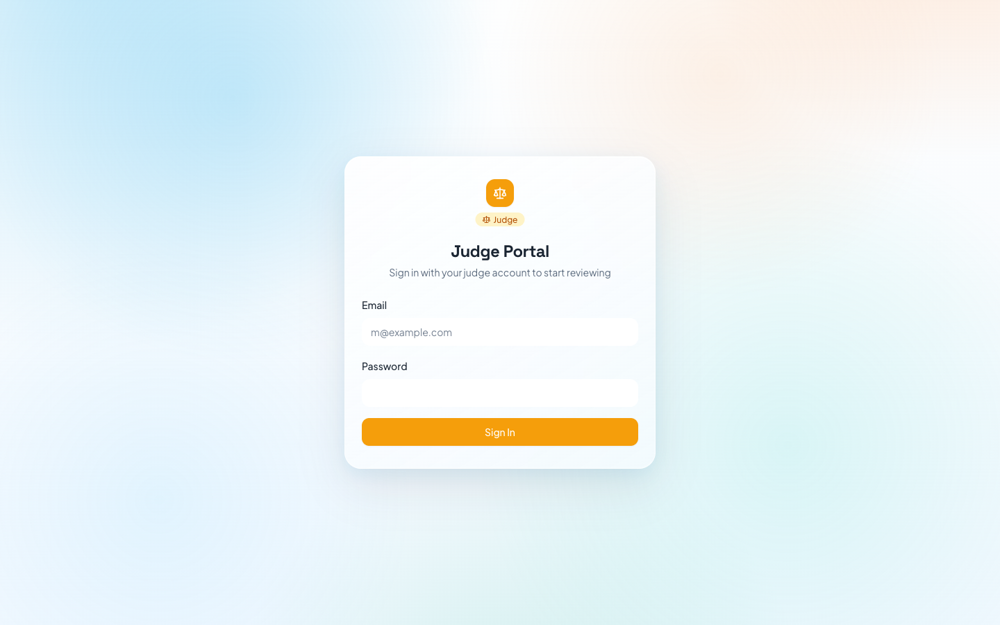 |

- 管理员登录后进入管理后台（侧边栏导航）
- 评委登录后进入评委工作台（顶部导航）
- 两端角色互斥：管理员无法从评委入口登录，反之亦然
- 首次部署通过 **Setup Wizard**（`/setup`）创建初始管理员账号和赛事

---

## ⚙️ 管理后台

### 仪表盘

登录后进入管理仪表盘。顶部展示当前赛事名称、状态徽章、标语。三张统计卡片显示核心指标：已提交项目数、已注册评委数、待审数量。下方「Next Steps」根据当前赛事状态智能推荐下一步操作（查看项目、分配评委等）。

左侧侧边栏按功能域分组：
- **Hackathon**：Projects / Review Management / Leaderboard
- **Judges**：Judge Management
- **Settings**：Hackathon Settings / Activity Log / Site Settings

侧边栏顶部始终显示当前赛事名称和时间范围。

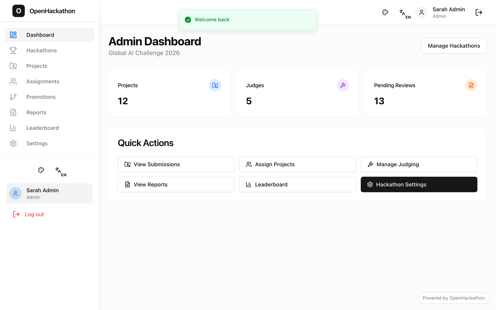

### 项目管理

项目列表页展示当前赛事下所有提交的项目。每一行显示：项目 ID、项目名称（含一句话简介）、提交人姓名和邮箱、状态徽章（Submitted）、平均分（已有评分时显示）。

支持的操作：
- **搜索**：按项目名称实时搜索
- **筛选**：按状态下拉筛选（All / Draft / Submitted）
- **行操作**：查看详情、查看评分、编辑、删除（每行四个图标按钮）
- **分页**：每页 50 条，支持翻页

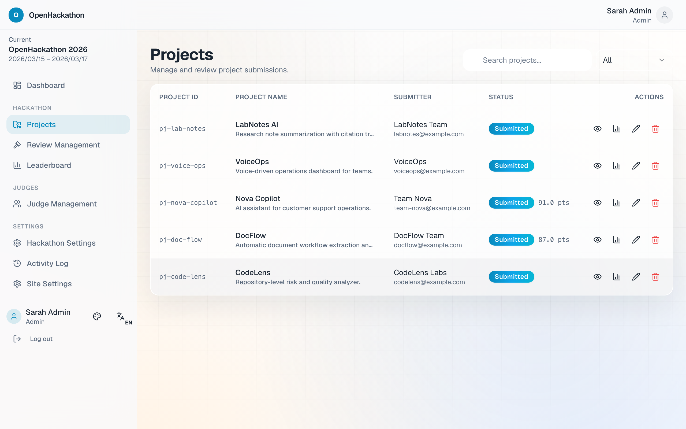

### 评审分配与管理

评审管理是整个系统的核心页面，聚合了分配、进度追踪、评分概览全流程：

**顶部工具栏**：
- 「Download CSV」导出评审数据
- 「Reset」重置所有分配
- 评委数量输入框 + 「Random Assign」一键均衡随机分配

**统计概览**（四项指标）：
- Total Projects：总项目数
- Average Score：已评分项目的平均分
- Completion Rate：评审完成率（含分数比如 2/5）
- Judges：当前赛事注册的评委总数

**双视图模式**：
- **列表视图**（默认）：每行一个项目，显示项目名、ID、提交人、已分配评委（彩色标签显示名字和分数）、平均分、完成进度。点击 `+` 按钮可手动指定新评委。
- **矩阵视图**：评委 × 项目的完整交叉表，适合批量操作。

**状态筛选标签**：All / Pending / In Progress / Completed，每个标签显示对应数量。

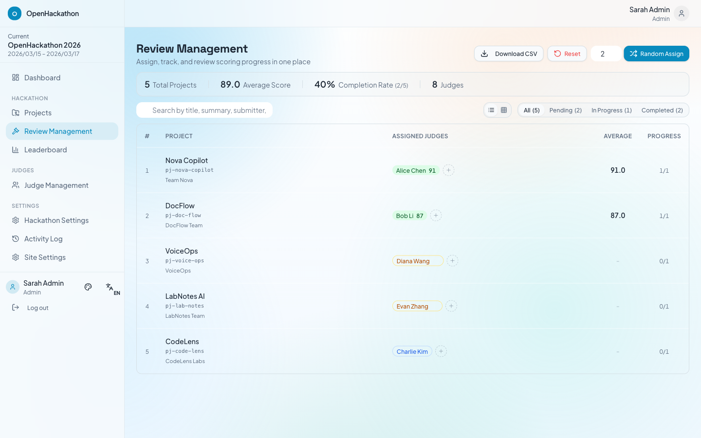

### 评委管理

评委采用「**账号全局、按赛事注册**」的机制：一个评委账号可以参与多场赛事，但每场赛事需要单独注册。只有注册到当前赛事的评委才能被分配评审任务。

页面分为两个区域：
- **已注册评委列表**：展示当前赛事下所有已注册的评委（头像首字母 + 姓名 + 邮箱），每行有「Unregister」按钮（有活跃分配时会阻止取消注册）
- **评委账号池**：展示系统中尚未注册到当前赛事的评委账号，可一键注册。还可以通过「Add Judge」按钮创建全新的评委账号（姓名 + 邮箱 + 密码）

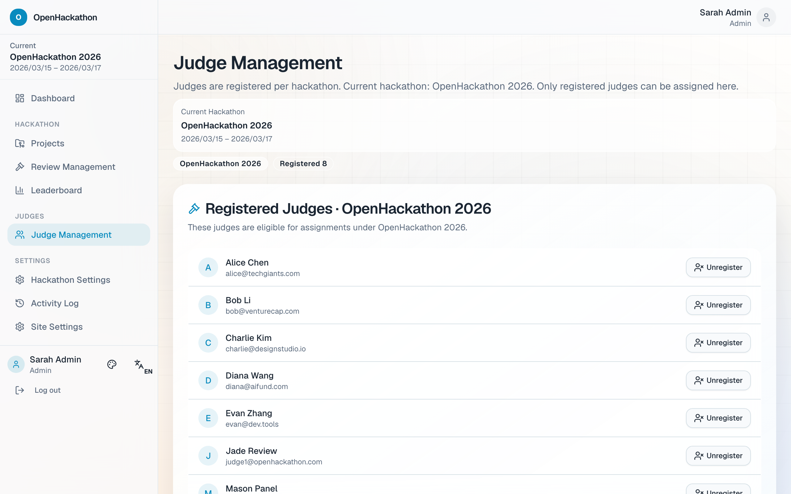

### 赛事设置（三标签页）

赛事设置分为三个独立的标签页。**赛事启动后所有设置自动锁定**，页面顶部显示黄色锁定提示，防止误改。

#### General Info — 基本信息

配置赛事的核心元数据：
- 赛事名称、标语、开始/结束日期
- 赛事详情文档：支持**外链 URL** 或 **本地文档上传**（Markdown / PDF），两种方式二选一，本地文档优先
- 提交成功提示文案和图片/二维码（用于引导参赛者加群等）
- 更多选项：城市、奖金池、封面渐变配色

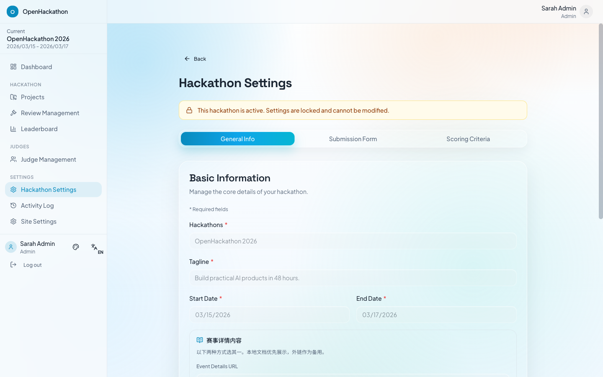

#### Submission Form — 提交表单配置

可视化表单字段构建器，配置参赛者提交项目时看到的表单：

- **内置字段**（始终显示，不可移除）：Project Name（必填）、Email Address（必填）、Your Name（选填）
- **自定义字段**：点击「Add Field」添加，每个字段可配置：
  - 标签（Label）、类型（Text Input / Text Area / URL / Select）、占位符（Placeholder）
  - 是否必填（Required 开关）
  - 是否可筛选（Filterable 开关 — 开启后该字段可在项目列表和评审分配页面作为筛选条件）
- Select 类型支持配置多个选项值
- 拖拽排序（通过左侧抓手图标）

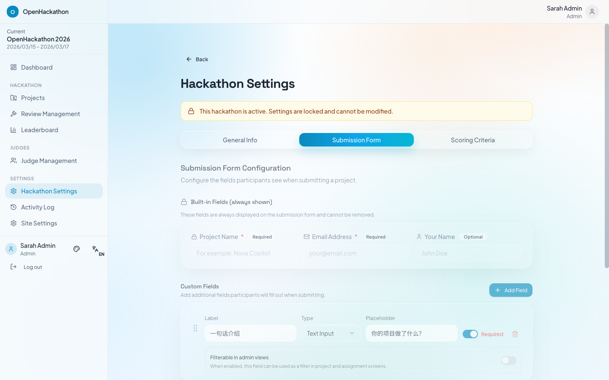

#### Scoring Criteria — 评分标准

配置评委打分时使用的评分维度：

- **Judges Per Project**：每个项目应分配多少位评委（1-20），随机分配时以此为目标数
- **评分标准列表**：每项包含标准名称（如 Innovation、Technology、Design & UX）和最高分值
- **总分校验**：所有标准的最高分之和必须恰好等于 **100 分**，否则无法保存
- 支持拖拽排序、添加、删除

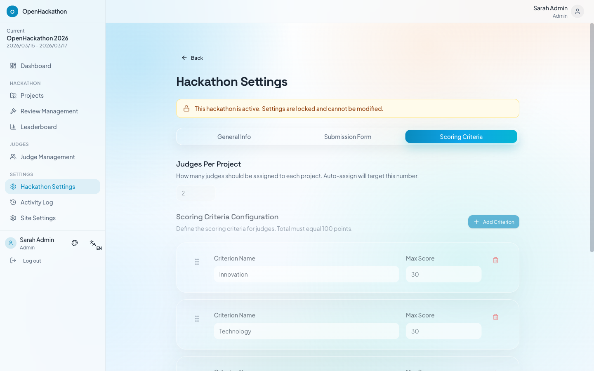

### 排行榜管理（Admin）

管理员端的排行榜页面展示按评分排序的项目列表，每个项目显示排名奖牌图标（金/银/铜）、项目名称、标签、简介、评分。

- **Draft / Published 状态**：默认为 Draft，管理员点击「Edit Rankings」可手动调整排名和奖项
- **发布控制**：发布后公开排行榜页面才会展示内容

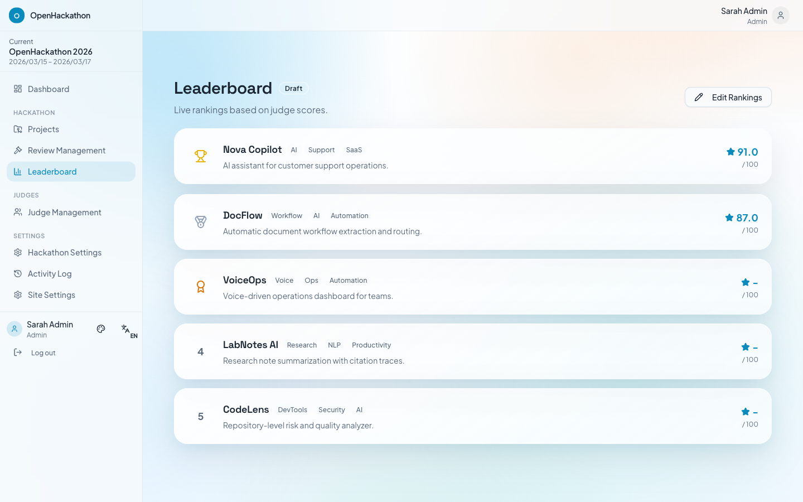

### 操作日志

全操作审计日志，记录系统中发生的所有关键操作：

- **统计概览**：总操作数、近 7 天操作数、评委操作数、管理员操作数
- **三维筛选**：按操作类型（create / update / delete / submit / assign / score / login 等）、对象类型（project / assignment / score / hackathon / judge / user / session / setting）、操作人筛选
- **分页**：每页 50 条


### 站点设置

站点设置控制全站级别的品牌、邮件、AI 和系统工具，分为四个标签页：

#### Branding — 品牌与 SEO
配置站点名称、管理后台入口路径（`adminBasePath`）、Logo、Favicon、浏览器标签标题、SEO 标题/描述、页脚 Powered By 文案和链接、是否显示 Powered By 徽章。

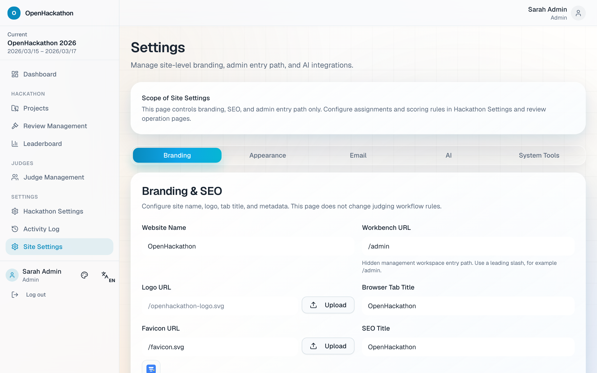

#### Email — 邮件配置
SMTP 服务器配置（host / port / security / user / password），内置邮件服务商预设（Gmail / Outlook / Zoho / 163），提交回执邮件主题模板，支持发送测试邮件。

#### AI — AI 集成
配置 OpenAI 兼容的 API（base URL / API key / model），支持 OpenAI、DeepSeek、SiliconFlow、本地 Ollama 等。

#### System Tools — 系统工具
- **重置当前赛事**：保留用户账号，清空项目和评审数据
- **工厂重置**：恢复到初始安装状态（需输入确认文字）

---

## 👨‍⚖️ 评委工作台

评委登录后进入独立的评委工作台，采用 **左右分栏** 布局：

**左侧 — 任务列表**：
- 标题「My Review Queue」
- 按状态分组：Pending（待评审 + 评审中）/ Completed（已完成）
- 每个任务卡片显示项目名称、简介、分数（已评分时）

**右侧 — 项目详情与评分**：

上半部分「Review Materials」：
- 项目名称、一句话简介、详细描述
- 标签（tags）
- 项目 ID 和提交人信息
- 代码仓库 / Demo 链接按钮
- 自定义提交字段数据（隐藏内部字段如 `_receipt`）

下半部分「Score Submission」：
- 按评分标准分项打分（每项显示名称、当前分 / 满分、数字输入框、分值范围提示）
- 实时汇总总分
- 评语输入框
- 提交按钮（所有标准必须填写才能提交）
- 已提交的评审显示绿色完成状态

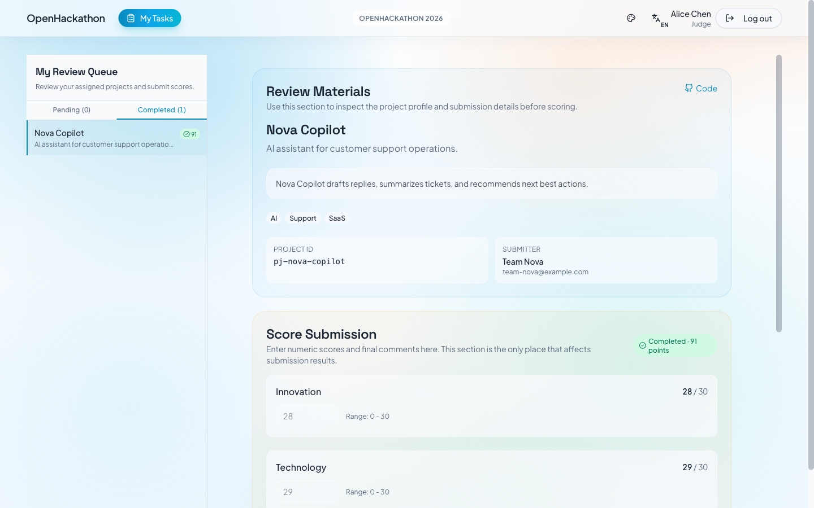

---

## 🖼️ 全部截图一览

| 公开首页 | 项目提交 | 公开排行榜 |
|---|---|---|
|  |  |  |

| 管理员登录 | 评委登录 | 管理仪表盘 |
|---|---|---|
|  |  |  |

| 项目管理 | 评审分配 | 评委管理 |
|---|---|---|
|  |  |  |

| 赛事设置 — 基本信息 | 提交表单配置 | 评分标准 |
|---|---|---|
|  |  |  |

| 排行榜管理 | 操作日志 | 站点设置 |
|---|---|---|
|  |  |  |

| 评委工作台 |
|---|
|  |

---

## 🏛️ 架构

### 技术栈
| 层 | 技术 |
|---|---|
| 前端 | React 18 + Vite + TailwindCSS + shadcn/ui + React Query + react-i18next |
| 后端 | Express.js + Prisma ORM + JWT 认证 |
| 数据库 | PostgreSQL |
| 测试 | Vitest（单元 + API 集成）+ Playwright（E2E）|
| 部署 | GitHub Actions → PM2 + Nginx |

### 后端模块化架构
按领域拆分为 **16 个路由模块** 和 **7 个工具模块**：

```
api/
├── server.ts          # Express 应用入口与中间件配置
├── config.ts          # 环境变量与常量集中管理
├── middleware.ts       # JWT 认证、角色鉴权中间件
├── types.ts           # 共享 TypeScript 类型定义
├── routes/            # 路由模块
│   ├── auth.ts        #   登录/注册（admin + judge 独立）
│   ├── hackathons.ts  #   活动 CRUD + 状态流转
│   ├── projects.ts    #   项目提交、编辑、删除、详情
│   ├── assignments.ts #   评审分配（随机/手动/批量）
│   ├── scores.ts      #   评分提交与查询
│   ├── judges.ts      #   评委注册/取消注册/创建
│   ├── promotions.ts  #   晋级决策（advanced/eliminated）
│   ├── reports.ts     #   评审报表（按项目/评委聚合）
│   ├── site-settings.ts # 站点设置 + 图片/文件上传
│   ├── users.ts       #   用户管理
│   ├── activity-logs.ts # 操作日志记录与查询
│   ├── leaderboard.ts #   排行榜配置与发布
│   ├── dashboard.ts   #   仪表盘统计数据
│   ├── setup.ts       #   首次初始化向导
│   ├── health.ts      #   健康检查 GET /api/health
│   └── system-reset.ts #  赛事重置 / 工厂重置
└── utils/             # 工具模块
    ├── validation.ts  #   输入校验（白名单 + 长度 + XSS/SQL 过滤）
    ├── hackathon.ts   #   活动业务逻辑
    ├── email.ts       #   SMTP 邮件发送
    ├── crypto.ts      #   加密工具
    ├── activity.ts    #   操作日志记录
    ├── documents.ts   #   文件上传处理
    └── formatting.ts  #   格式化工具
```

### 安全机制
| 机制 | 说明 |
|---|---|
| JWT 认证 | admin / judge 独立令牌，支持 issuer/audience 校验，令牌过期自动清除 |
| 输入校验 | 全字段白名单校验 + 长度限制 + SQL 注入/XSS 关键词过滤 |
| 速率限制 | 全局 API 限流（1200/15min）+ 登录接口独立限流（20/15min）+ 提交接口独立限流（30/10min）|
| CORS | 支持逗号分隔的域名白名单，可配置 `CORS_ALLOW_ALL` |
| 文件上传 | 类型白名单（PNG/JPG/SVG/MD/PDF）+ 大小限制 + 文件名安全过滤 |

---

## 🚀 快速开始

### 环境要求
- Node.js 20+
- Docker + Docker Compose

### 一键启动
```bash
git clone https://github.com/frankfika/openhackathon.git
cd openhackathon
npm install
npm run dev:up
```

自动完成：启动 PostgreSQL 容器 → 等待数据库就绪 → 同步 Prisma schema → 启动前后端开发服务。

首次访问会进入 **Setup Wizard**（`/setup`），引导创建管理员账号和初始赛事。

### 常用命令
```bash
npm run dev:up         # 启动开发栈（不含 seed 数据）
npm run dev:up:seed    # 启动开发栈 + 写入演示数据
npm run dev:down       # 关闭数据库容器
npm run db:reset       # 重置到初始状态（进入 Setup Wizard）
npm run db:reset:seed  # 重置 + 写入演示数据
npm run dev            # 仅启动前后端（需自行管理数据库）
```

### 默认账号（seed 数据）
| 角色 | 邮箱 | 密码 | 说明 |
|---|---|---|---|
| 管理员 | `admin@openhackathon.com` | `password` | 主管理员，数据最完整 |
| 备用管理员 | `ops@openhackathon.com` | `password` | 干净管理员，无个人业务历史 |
| 评委 | `alice@techgiants.com` | `password` | 有已完成的评审任务 |
| 评委 | `bob@venturecap.com` | `password` | 有已完成的评审任务 |
| 评委 | `charlie@designstudio.io` | `password` | 有进行中的评审任务 |
| 空评委 | `judge1@openhackathon.com` | `password` | 无任何分配，适合测试空状态 |

完整 seed 包含 **10** 个账号、**7** 场 hackathon、**32** 个项目、**44** 条评审任务，覆盖 active / upcoming / draft / judging / completed 五类赛事状态。

---

## 🧪 测试

```bash
npm run test:unit    # 单元测试（111 passed）
npm run test:api     # API 集成测试（43 passed）
npm run test:e2e     # E2E 端到端测试（Playwright）
npm run lint         # ESLint 检查（0 errors）
npx tsc --noEmit     # TypeScript 类型检查
```

---

## 🏗️ 部署

### 在线演示
> **体验地址：http://49.234.25.35**（腾讯云轻量服务器，国内可直接访问）

### 一键部署（Ubuntu）
```bash
curl -fsSL https://raw.githubusercontent.com/frankfika/openhackathon/main/scripts/deploy-server.sh | bash
```
脚本自动完成：安装 Node.js 20 / PostgreSQL / Nginx / PM2 → 克隆代码 → `npm install` → 构建前端 → 数据库迁移 → 启动服务 → 配置 Nginx 反向代理。

### 自动部署（CI/CD）
仓库已配置 GitHub Actions（`.github/workflows/deploy.yml`），推送到 `main` 分支后自动部署到生产服务器，约 2 分钟完成：
```bash
git push origin main  # 自动触发：git pull → npm install → build → migrate → pm2 restart
```

### Docker Compose
```bash
docker compose up -d --build
```

默认端口：
| 服务 | 端口 |
|---|---|
| Web（Vite） | `5173` |
| API（Express） | `3001` |
| PostgreSQL | `5432` |
| Adminer | `8080` |

---

## 📧 邮件与安全配置

<details>
<summary><b>提交回执邮件配置</b></summary>

在 `.env` 中配置（完整示例见 `.env.example`）：

```bash
SUBMISSION_EMAIL_ENABLED=true
SMTP_HOST=smtp.example.com
SMTP_PORT=587
SMTP_SECURE=false
SMTP_USER=your_smtp_user
SMTP_PASS=your_smtp_password
SUBMISSION_RECEIPT_FROM="OpenHackathon <no-reply@example.com>"
SUBMISSION_RECEIPT_REPLY_TO=ops@example.com
SUBMISSION_RECEIPT_SUBJECT="[{{hackathonTitle}}] Submission Receipt {{receiptId}}"
SUBMISSION_EMAIL_TIMEOUT_MS=10000
```

说明：
- `SUBMISSION_EMAIL_ENABLED=false` 时不发邮件，但仍生成回执号
- 主题模板支持变量：`{{hackathonTitle}}`、`{{receiptId}}`、`{{projectTitle}}`
- 管理员可通过 `POST /api/projects/:id/receipt/resend` 手动重发回执
- 后台「Site Settings → Email」标签页可通过 UI 配置，内置 Gmail / Outlook / Zoho / 163 预设
</details>

<details>
<summary><b>安全变量配置</b></summary>

```bash
JWT_SECRET=your_strong_random_secret        # 必须！生产环境使用强随机值
JWT_ISSUER=openhackathon                    # JWT issuer 校验
JWT_AUDIENCE=openhackathon-clients          # JWT audience 校验
AUTH_DISABLED=false                          # 生产环境务必为 false
CORS_ORIGINS=https://your-domain.com        # 逗号分隔多个来源
CORS_ALLOW_ALL=false                        # 生产环境务必为 false
TRUST_PROXY=1                               # 反向代理后设置，确保限流使用真实 IP
JSON_BODY_LIMIT=1mb                         # 请求体大小限制
API_RATE_LIMIT_WINDOW_MS=900000             # 全局限流窗口（15 分钟）
API_RATE_LIMIT_MAX=1200                     # 全局限流上限
AUTH_RATE_LIMIT_WINDOW_MS=900000            # 登录限流窗口
AUTH_RATE_LIMIT_MAX=20                      # 登录限流上限（防暴力破解）
SUBMISSION_RATE_LIMIT_WINDOW_MS=600000      # 提交限流窗口（10 分钟）
SUBMISSION_RATE_LIMIT_MAX=30                # 提交限流上限（防刷）
```
</details>

---

## 📦 发布
- Releases: https://github.com/frankfika/openhackathon/releases
- 建议使用语义化版本（`vX.Y.Z`）并附带变更说明

## 📄 License
MIT
