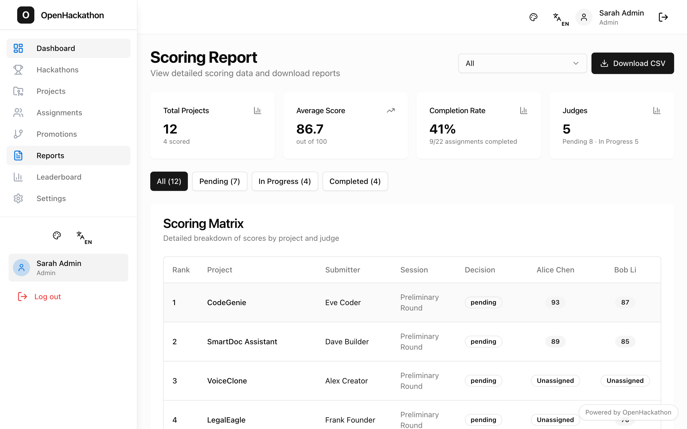
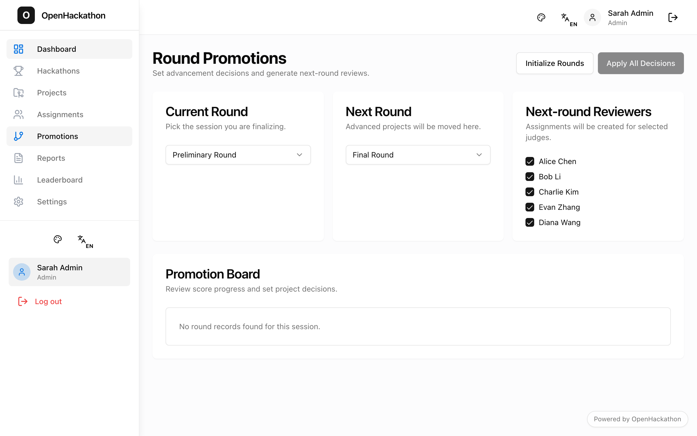

<div align="center">

# OpenHackathon
> 开源黑客松管理平台 · Open Source Hackathon Management Platform


[核心能力](#-核心能力) • [界面截图](#-界面截图) • [体验基线](#-体验基线) • [快速开始](#-快速开始) • [部署](#-部署) • [发布](#-发布)

__简体中文__ | [English](./README_EN.md)

---
</div>

## 📖 项目简介
OpenHackathon 是一个面向黑客松主办方、评委与参赛团队的全流程平台：
- 主办方可以管理活动、赛程、评审标准、项目分配、晋级与榜单。
- 评委可以在统一界面查看任务、打分、提交评语。
- 参赛者可以公开提交项目并在排行榜中查看结果。

## ✨ 核心能力
### 1. 活动与赛程管理
- 支持多活动（Hackathon）与多轮赛程（初赛/复赛/决赛）。
- **赛程管理**：独立标签页管理各轮次，支持设置赛区（region）进行多地区并行举办。
- 可配置评分标准、提交字段、活动状态。


### 2. 品牌与 SEO 白标能力
- 支持后台修改站点名、Logo、Tab 标题、SEO 标题/描述、Favicon。
- 默认品牌为 `OpenHackathon`，开箱即可用，也支持私有化改造。


### 3. 评审与评分流程
- 支持项目分配、评分提交、评论、状态流转。
- 报表可按项目/评委维度聚合评分与进度。



### 4. 晋级与多轮评审
- 支持项目晋级决策（advanced/eliminated/pending）。
- 晋级后可自动进入下一轮并生成新一轮评审任务。



### 5. 赛事详情统一入口（规则/文档去重）
- 前台统一使用「赛事详情」入口，不再拆分成重复的“规则”和“文档”菜单。
- 文档来源按优先级自动回退：`gitbookUrl` → `rulesUrl` → `detailsUrl`。
- 后台活动设置支持三种链接配置，便于主办方逐步完善内容。

### 6. 公开提交回执与邮件通知
- `/submit` 页面仅强制邮箱，提交后后端自动生成回执号（如 `SUB-20260228-ABC123`）。
- 后端可通过 SMTP 自动发送回执邮件，并在回执中记录发送状态（`emailSent`/失败原因/最后尝试时间）。
- 支持管理员手动重发回执：`POST /api/projects/:id/receipt/resend`。

## 📧 提交回执邮件配置
在 `.env` 中配置以下变量（完整示例见 `.env.example`）：

```bash
SUBMISSION_RECEIPT_PREFIX=SUB
SUBMISSION_EMAIL_ENABLED=true
SMTP_HOST=smtp.example.com
SMTP_PORT=587
SMTP_SECURE=false
SMTP_USER=your_smtp_user
SMTP_PASS=your_smtp_password
SUBMISSION_RECEIPT_FROM="OpenHackathon <no-reply@example.com>"
SUBMISSION_RECEIPT_REPLY_TO=ops@example.com
SUBMISSION_RECEIPT_SUBJECT="[{{hackathonTitle}}] Submission Receipt {{receiptId}}"
SUBMISSION_EMAIL_TIMEOUT_MS=10000
```

说明：
- `SUBMISSION_EMAIL_ENABLED=false` 时，不会发邮件，但仍会生成回执号并记录 `emailFailureReason=disabled`。
- `SUBMISSION_RECEIPT_SUBJECT` 支持模板变量：`{{hackathonTitle}}`、`{{receiptId}}`、`{{projectTitle}}`。
- 若 SMTP 短时异常，可在后台调用重发接口补发回执。

## 🔐 安全配置（建议）
在 `.env` 中补充以下安全变量（完整示例见 `.env.example`）：

```bash
AUTH_DISABLED=false
JWT_ISSUER=openhackathon
JWT_AUDIENCE=openhackathon-clients
CORS_ORIGINS=http://localhost:5173
CORS_ALLOW_ALL=false
TRUST_PROXY=
JSON_BODY_LIMIT=1mb
API_RATE_LIMIT_WINDOW_MS=900000
API_RATE_LIMIT_MAX=1200
AUTH_RATE_LIMIT_WINDOW_MS=900000
AUTH_RATE_LIMIT_MAX=20
SUBMISSION_RATE_LIMIT_WINDOW_MS=600000
SUBMISSION_RATE_LIMIT_MAX=30
```

说明：
- 生产环境务必设置强随机 `JWT_SECRET`，且不要开启 `AUTH_DISABLED`。
- 推荐在网关/反向代理后设置 `TRUST_PROXY`（如 `1`），确保限流与审计使用真实客户端 IP。
- JWT 已启用 `issuer/audience` 校验，`JWT_ISSUER` / `JWT_AUDIENCE` 需在签发与校验侧保持一致。
- `CORS_ORIGINS` 支持逗号分隔多个来源（如 `https://admin.example.com,https://app.example.com`）。
- 登录接口已启用单独限流，防止暴力破解。
- 公开提交接口（`POST /api/projects`）已启用独立限流，防止批量刷提交。
- API 暴露健康检查：`GET /api/health`。

## 🖼️ 界面截图
| 首页 | 项目页 | 排行榜 |
|---|---|---|
|  |  |  |

| 评审页 | 设置页 | 晋级管理 |
|---|---|---|
|  |  |  |

## 🎨 体验基线
- 首页视觉与 README 截图 `docs/assets/home.png` 对齐，确保线上 UI 风格一致。
- 管理端与评委端共用同一套玻璃质感组件（按钮、卡片、输入、表格、弹窗、Tabs）。
- 所有关键列表页（项目、评分报表、晋级、设置）统一为“概览区 + 面板区 + 表格区”的层次结构。

## 🚀 快速开始
### 环境要求
- Node.js 20+（推荐）
- PostgreSQL 15+

### 本地开发
```bash
git clone https://github.com/frankfika/openhackathon.git
cd openhackathon
npm install

# 初始化数据库
npx prisma db push
npm run db:seed

# 启动前后端
npm run dev
```

默认账号（seed）：
- 管理员：`admin@openhackathon.com` / `password`
- 评委：`alice@techgiants.com` / `password`

### 测试
```bash
npm run test:unit
npm run test:api
npm run test:e2e
```

## 🏗️ 部署
### Docker Compose
```bash
docker compose up -d --build
```

默认端口：
- Web: `5173`
- API: `3001`
- PostgreSQL: `5432`
- Adminer: `8080`

## 🧰 文档截图脚本
README 截图来自真实运行站点（非模拟）：
```bash
BASE_URL=http://localhost:5173 node scripts/capture-screenshots.mjs
```

## 📦 发布
- Releases: https://github.com/frankfika/openhackathon/releases
- 建议使用语义化版本（`vX.Y.Z`）并附带变更说明。

## 📄 License
MIT
