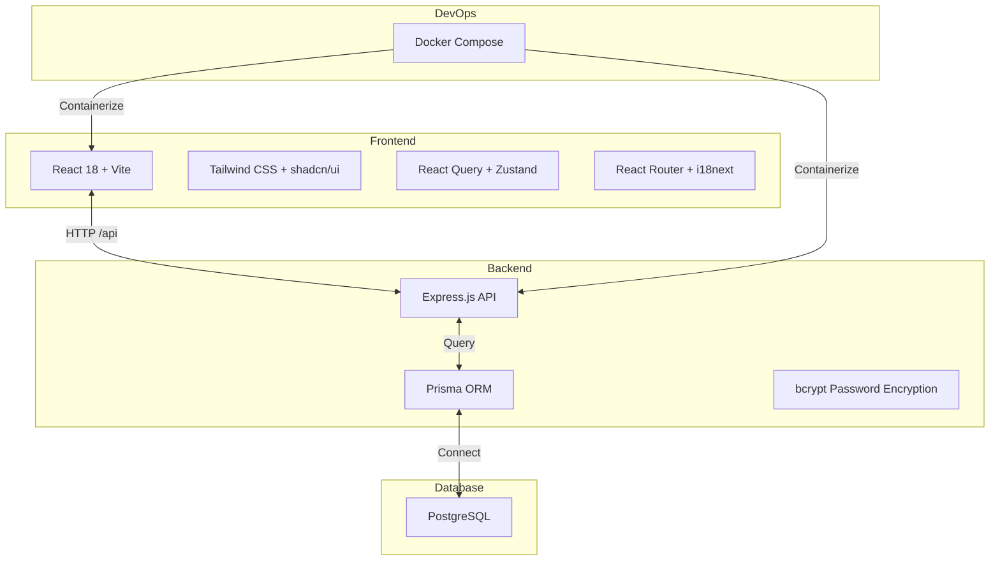

<div align="center">

# OpenHackathon
> White-label Hackathon Management Platform · 白标黑客松管理平台


### 🚀 Deploy Your Own Hackathon Platform in Minutes


[Features](#-features) • [Screenshots](#-screenshots) • [Quick Start](#-quick-start) • [Architecture](#-architecture) • [Deployment](#-deployment)

[简体中文](./README.md) | __English__

---
</div>

## 📖 Introduction

OpenHackathon is a modern **white-label hackathon management platform** designed for universities, enterprises, and developer communities. Administrators can easily manage multiple competitions from the backend, judges can review projects online, and participants can submit their work and view rankings.

### Why Choose OpenHackathon?

| Traditional Approach | OpenHackathon |
|---------------------|---------------|
| Build from scratch, takes months | One-click deployment, ready to use |
| Limited features, hard to extend | Multi-role permissions, flexible configuration |
| Chaotic review process | Systematic assignment and scoring |
| No data insights | Real-time statistics and leaderboards |

## ✨ Features

### 1. 🎨 White-Label Customization
Customize your brand identity through environment variables:

- **Brand Configuration** — Custom organizer name, logo, and primary color
- **No Platform Branding** — Option to hide "Powered by" badge
- **Flexible Adaptation** — Quickly deploy as a dedicated platform for universities, enterprises, or government agencies


### 2. 👥 Multi-Role Permission System

| Role | Permissions | Use Case |
|------|-------------|----------|
| **Admin** | Create/manage competitions, assign judges, view all data | Event organizer team |
| **Judge** | View assigned projects, multi-dimensional scoring, AI-assisted review | Technical experts, investors |


### 3. ⚖️ Intelligent Judging System

- **Project Assignment** — Flexibly assign projects to specific judges to ensure review independence
- **Multi-Dimensional Scoring** — Support custom scoring criteria (innovation, technology, design, completion, etc.)
- **AI-Assisted Review** — Intelligent generation of review suggestions to improve efficiency
- **Real-Time Calculation** — Automatic calculation of total scores and rankings


### 4. 🏆 Leaderboard & Showcase

- **Public Leaderboard** — Real-time updated project rankings display
- **Project Gallery** — Beautiful project showcase page with tag filtering
- **Data Analytics** — Statistics charts for review progress, score distribution, etc.


### 5. 📁 Project Management

- **Project Submission** — Support for custom submission form fields
- **Work Showcase** — Project detail pages displaying descriptions, screenshots, and links
- **Batch Management** — Import/export, batch judge assignment


### 6. 🌍 Developer Experience

- **Internationalization** — Chinese and English support, based on react-i18next
- **Dark Mode** — Built-in theme switching for eye comfort
- **Responsive Design** — Support for desktop, tablet, and mobile access
- **Full-Stack TypeScript** — Type safety, excellent development experience

## 🖼️ Screenshots

| Landing Page | Project Gallery | Leaderboard |
|--------------|-----------------|-------------|
|  |  |  |
| Hero section, countdown, registration entry | Project cards, tag filtering, search | Real-time rankings, score display, podium |

| Admin Dashboard | Judging Interface | Event Settings |
|-----------------|-------------------|----------------|
|  |  |  |
| Data statistics, event switching, quick actions | Project details, slider scoring, AI suggestions | Competition config, scoring criteria, rule settings |

## 🚀 Quick Start

### Requirements

- Node.js 18+
- PostgreSQL 15+
- Docker & Docker Compose (optional, for production deployment)

### Local Development

```bash
# 1. Clone the repository
git clone https://github.com/frankfika/openhackathon.git
cd openhackathon

# 2. Install dependencies
npm install

# 3. Configure environment variables
cp .env.example .env
# Edit .env to set database connection and white-label config

# 4. Initialize database
npx prisma migrate dev --name init
npx prisma db seed

# 5. Start development server
npm run dev
```

Visit http://localhost:5173

**Default Accounts:**
- Admin: `admin@openhackathon.com` / `password`
- Judge: `alice@techgiants.com` / `password`

## 🏗️ Architecture



### Directory Structure

```
openhackathon/
├── api/
│   └── server.ts              # Express backend service
├── prisma/
│   ├── schema.prisma          # Database model definitions
│   └── seed.ts                # Seed data
├── src/
│   ├── components/            # React components
│   │   ├── ui/                # shadcn/ui components
│   │   └── dashboard/         # Dashboard components
│   ├── lib/
│   │   ├── api.ts             # API client
│   │   ├── auth.tsx           # Authentication context
│   │   ├── types.ts           # TypeScript types
│   │   └── i18n.ts            # Internationalization config
│   ├── pages/                 # Page components
│   └── App.tsx                # App entry
├── docs/assets/               # Screenshot assets
└── scripts/                   # Utility scripts
```

## 📦 Deployment

### Option 1: Docker Compose (Recommended)

```bash
# Clone repository
git clone https://github.com/frankfika/openhackathon.git
cd openhackathon

# Start all services
docker-compose up -d --build

# Initialize database
docker-compose exec api npx prisma migrate dev --name init
docker-compose exec api npx prisma db seed
```

Service Ports:

| Service | Port | Description |
|---------|------|-------------|
| Web | 5173 | React frontend |
| API | 3001 | Express backend |
| DB | 5432 | PostgreSQL |
| Adminer | 8080 | Database management UI |

### Option 2: Manual Deployment

```bash
# Build frontend
npm run build

# Start backend
npm run server

# Use Nginx or Caddy for reverse proxy
```

### White-Label Configuration

Customize your brand through environment variables:

| Variable | Default | Description |
|----------|---------|-------------|
| `VITE_ORGANIZER_NAME` | `Acme Corp` | Organizer name |
| `VITE_ORGANIZER_LOGO` | - | Logo URL |
| `VITE_PRIMARY_COLOR` | `#6366f1` | Primary color |
| `VITE_SHOW_POWERED_BY` | `true` | Show Powered by badge |

## 🛣️ Roadmap

### v1.0.0 (Current)
- ✅ White-label configuration system
- ✅ Multi-role permission management
- ✅ Competition session management
- ✅ Project assignment and judging
- ✅ Real-time leaderboard
- ✅ Chinese and English support
- ✅ Docker deployment

### v1.1.0 (Planned)
- 🚧 Team management features
- 🚧 Online code submission integration
- 🚧 More AI-assisted features
- 🚧 Email notification system

### v1.2.0 (Planned)
- 🚧 Payment integration (registration fees)
- 🚧 Automatic certificate generation
- 🚧 More theme templates
- 🚧 Mobile App

## 🤝 Contributing

1. Fork this repository
2. Create a feature branch `git checkout -b feature/amazing-feature`
3. Commit your changes `git commit -m 'feat: add amazing feature'`
4. Push to the branch `git push origin feature/amazing-feature`
5. Create a Pull Request

### Development Guidelines

- Use TypeScript strict mode
- Use functional programming for components
- Follow [Conventional Commits](https://conventionalcommits.org/) for commit messages
- Pass ESLint checks

## 📄 License

Copyright © 2025 OpenHackathon Team

Licensed under the [MIT License](./LICENSE)

---

<p align="center">
  Made with ❤️ for the hackathon community
</p>
